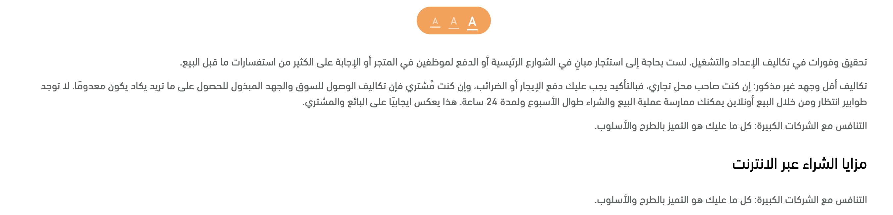

This is a [Blog-UI](https://blog-ui-psi.vercel.app/) project

### Technologies used

- NextJS
- TypeScript
- Redux Toolkit
- Tailwind CSS
- Formik and Yup for form handling and validation

## Getting Started

First, run the development server:

```bash
npm run dev
# or
yarn dev
```

Open [http://localhost:3000](http://localhost:3000) with your browser to see the result.

## Features

- I used [Next.js API Routes](https://nextjs.org/docs/api-routes/introduction) to create backend and build fake data for the project.
- I used [next-seo](https://github.com/garmeeh/next-seo) to handle SEO for all the pages
- used SSR as requested and added option for caching too,

```bash
   res.setHeader(
   "Cache-Control",
   "public, s-maxage=10, stale-while-revalidate=59"
 );
```

- added a [loader](https://github.com/mhnpd/react-loader-spinner) to handle the loading state and customized it to use the branded colors form the Figma design
- used Redux to handle state for the app, currently, the icons for changing the article font size are working and all dynamic.
  
- added form validation for writing comments or subscribing to newsletter ,
  validation is working in submiting or even onBlur for all the fields.
- there are also API Routes for simulating submitting the forms and I used [React-Toastify](https://www.npmjs.com/package/react-toastify) for displaying messages to the user accordingly.
- added [sitemap geneator](https://www.npmjs.com/package/next-sitemap) for the project, it generates a sitemap.xml file and it includes automatically all the pages including the dynamic ones, it runs automaticaly when the project is deployed.
- the project is using TypeScript including the API Routes.

## Deploy on Vercel

- The project is deployed on [Vercel](https://vercel.com/) and it is available on [Blog-UI](<(https://blog-ui-psi.vercel.app/)>).

- it is connected to this Repository, so it redeploy automatically when the code is changed.
